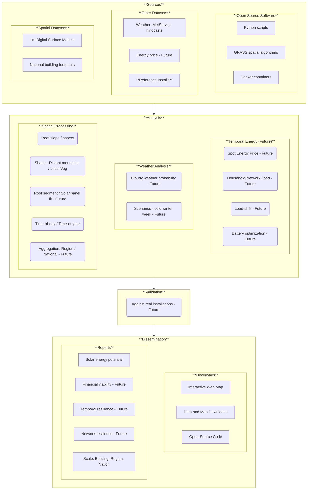

# Software Architecture and System Design

## Overview
The **solar-estimates** project is a **Docker** containerised geospatial processing pipeline designed to estimate rooftop solar potential across New Zealand. It leverages **GRASS GIS** for heavy-duty spatial analysis and **GDAL** for data translation, all orchestrated by a **Python 3.12** ```pipeline.py``` application.

_This content is mostly AI generated from source code (as at Jan 2026)._

**Last updated:** Feb 2026

## System Workflow

graph TD

    %% Source Datasets
    subgraph "Source Datasets (Input)"
        SD1[(DSM GeoTIFF Tiles)] 
        SD2[(Building Outlines GPKG/SHP)]
        SD3[(WRF NetCDF - Optional)]
    end

    %% Processing Pipeline (Using Stadium Shapes for Actions)
    subgraph "Pipeline - pipeline.py"
        P1[merge_rasters]
        P2[calculate_slope_aspect_rasters]
        P3[calculate_solar_irradiance_interpolated]
        P4[load_building_outlines]
        P5[calculate_outline_raster]
        P6[process_wrf_for_grass]
        P7[create_stats]
    end

    %% Intermediate Datasets (Using Subroutine shapes for Data)
    subgraph "Internal GRASS Mapset (Intermediate)"
        ID1[[Merged VRT / DSM Raster]]
        ID2[[Slope & Aspect Rasters]]
        ID3[[Clear-Sky Irradiance Rasters]]
        ID4[[Building Vector Map]]
        ID5[[Solar Coefficient Rasters]]
        ID6[[WRF Adjusted Total Raster]]
    end

    %% Target Datasets
    subgraph "Target Datasets (Output)"
        TD1[(Building Stats GeoPackage)]
        TD2[(Building Stats CSV)]
        TD3[(Final GeoTIFFs - Optional)]
    end

    %% Data Flow
    SD1 --> P1 --> ID1
    ID1 --> P2 --> ID2
    ID1 & ID2 --> P3 --> ID3
    SD2 --> P4 --> ID4
    ID3 & ID4 --> P5 --> ID1
    
    %% WRF Path
    SD3 --> P6 --> ID5
    ID3 & ID5 --> P6 --> ID6
    
    %% Final Aggregation
    ID1 & ID4 & ID6 --> P7
    P7 --> TD1 & TD2
    P5 & ID2 --> TD3
```

## Technology Stack

### Containerisation
The system is built on **Docker** and **Docker Compose** to ensure a consistent environment across different platforms (Linux, macOS, Windows).
*   **Base Image:** Ubuntu 24.04 LTS (Noble).
*   **Geospatial Libraries:** Uses the **UbuntuGIS Unstable PPA** to provide the latest versions of GRASS GIS (8.4+) and GDAL.
*   **Python Environment:** Dependencies are managed within a virtual environment (`/opt/venv`) to avoid conflicts with system-level packages.

### Computational Engines
*   **GRASS GIS:** Acts as the primary spatial database and computational engine. It handles solar radiation modelling (`r.sun`), geometric calculations (`r.slope.aspect`), and statistical aggregation.
*   **GDAL:** Used for initial data discovery, building Virtual Rasters (VRT), and final data format exports.

## Target architecture
The following diagram shows the future architecture we are working toward.


_Diagram: Target high level architecture. Boxes tagged with "Future" are planned for a future implementation._