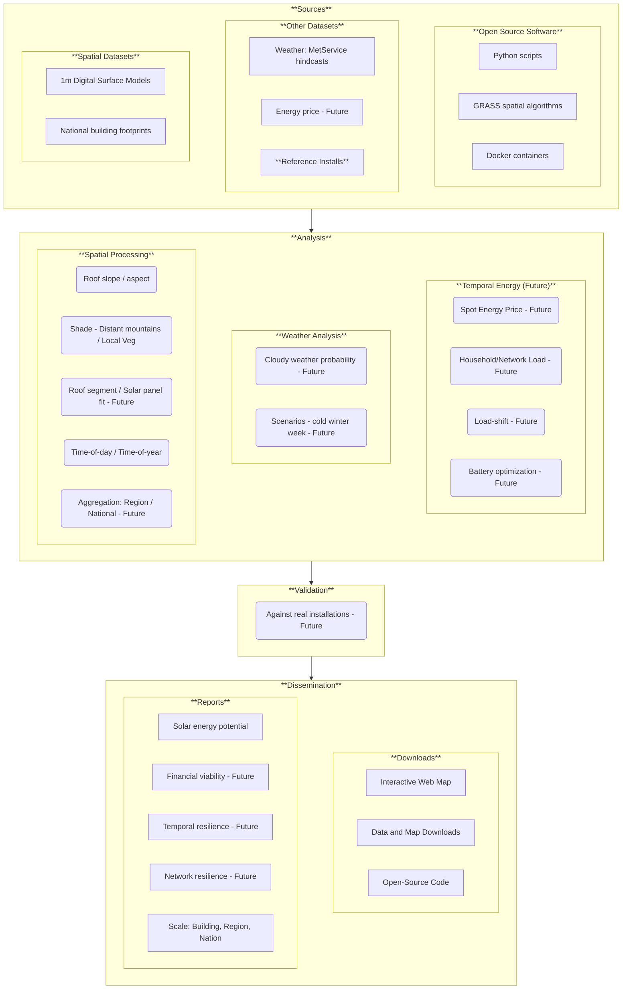

# Software design
This section concisely touches on key design concepts for our ```solar estimates``` project. 

We aim to keep this document **concise** and **timeless**, so that it is:

* Quick to read.
* Easy to absorb.
* Easy to maintain.

**Last updated:** Jan 2026

## High level architecture


_Diagram: High level architecture. Boxes tagged with "Future" are planned for a future implementation._