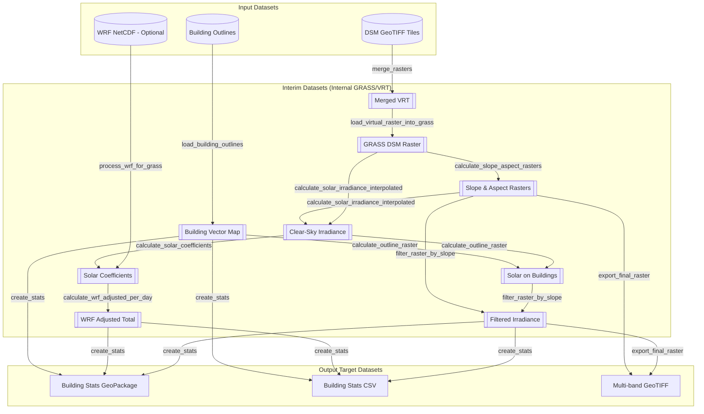
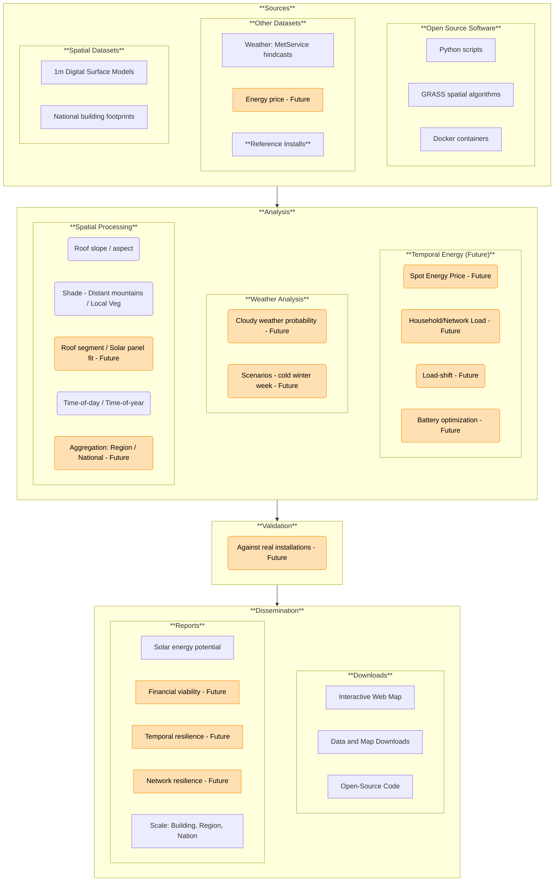

# Software Architecture and System Design

## Overview
The **solar-estimates** project is a **Docker** containerised geospatial processing pipeline designed to estimate rooftop solar potential across New Zealand. It leverages **GRASS GIS** for heavy-duty spatial analysis and **GDAL** for data translation, all orchestrated by a **Python 3.12** ```pipeline.py``` application.

_This content is mostly AI generated from source code (as at Jan 2026)._

**Last updated:** Feb 2026

## System Workflow



## Technology Stack

### Containerisation
The system is built on **Docker** and **Docker Compose** to ensure a consistent environment across different platforms (Linux, macOS, Windows).

*   **Base Image:** Ubuntu 24.04 LTS (Noble).
*   **Geospatial Libraries:** Uses the **UbuntuGIS Unstable PPA** to provide the latest versions of GRASS GIS (8.4+) and GDAL.
*   **Python Environment:** Dependencies are managed within a virtual environment (`/opt/venv`) to avoid conflicts with system-level packages.

### Computational Engines

*   **GRASS GIS:** Acts as the primary spatial database and computational engine. It handles solar radiation modelling (`r.sun`), geometric calculations (`r.slope.aspect`), and statistical aggregation.
*   **GDAL:** Used for initial data discovery, building Virtual Rasters (VRT), and final data format exports.

## Target architecture

The following diagram shows the future architecture we are working toward.


_Diagram: Target high level architecture. Boxes tagged with "Future" are planned for a future implementation._