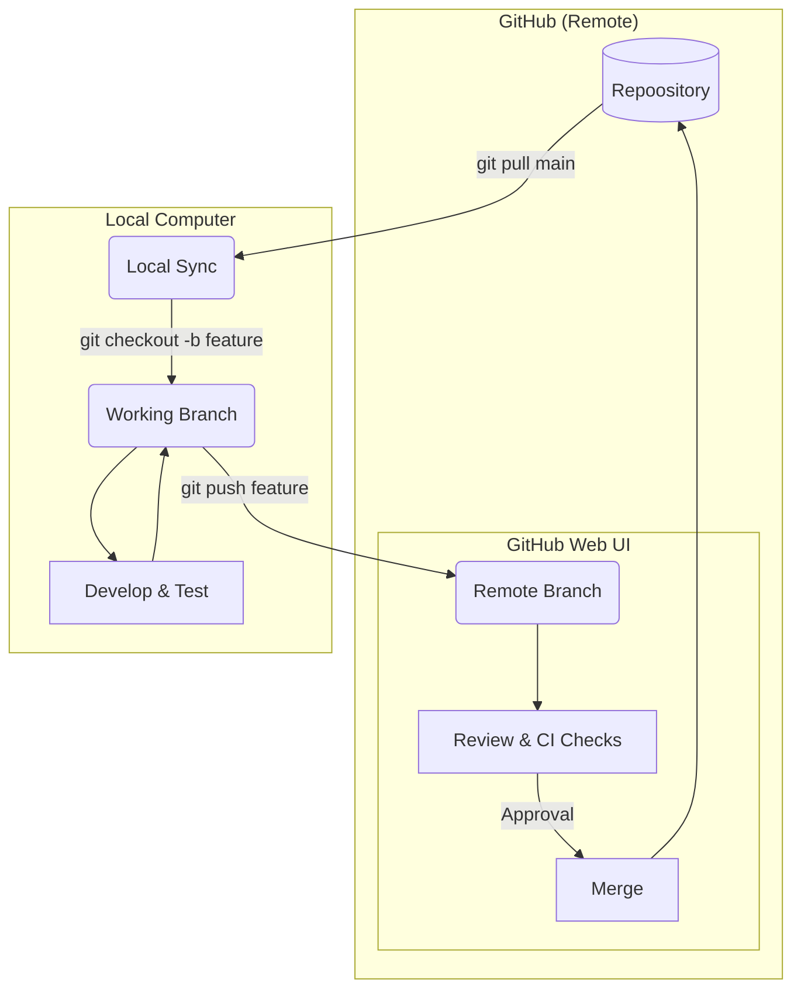

# Github Contribution Guide

_This guide outlines our github contribution process for our NZ Solar Map project._

## Prerequisites

* Familiarity with the command line and git.
* You've cloned our git repository.

## Workflow

## Summary of Steps

* **Branch Strategy:**
    * Develop in git branches. Don't git push to `main`.
    * `git pull origin main` before you start.
    * Push your branch to GitHub.
* **GitHub Web UI:**
    * Open Pull Request on [GitHub](https://github.com/rewiring-nz/solar-estimates).
    * Wait for Automated Tests - Green Check.
    * Request review.
        * _Note: For low-impact documentation changes, you may proceed without a review._
    * Merge.

---

## Location of Settings

Rules for our workflow are found in :

* [Branch Protection Rules](https://github.com/rewiring-nz/solar-estimates/settings/branches): `Settings` > `Branches` > `Branch protection rules`.
* [Actions & CI/CD Settings](https://github.com/rewiring-nz/solar-estimates/settings/actions): `Settings` > `Actions` > `General`.
* [Collaborators & Teams](https://github.com/rewiring-nz/solar-estimates/settings/access): `Settings` > `Collaborators and teams`.

!!! tip "Admin Access Required"
    Only users with **Admin** permissions can see the `Settings` tab. If you cannot see it, contact the repository owner to update your permission level.