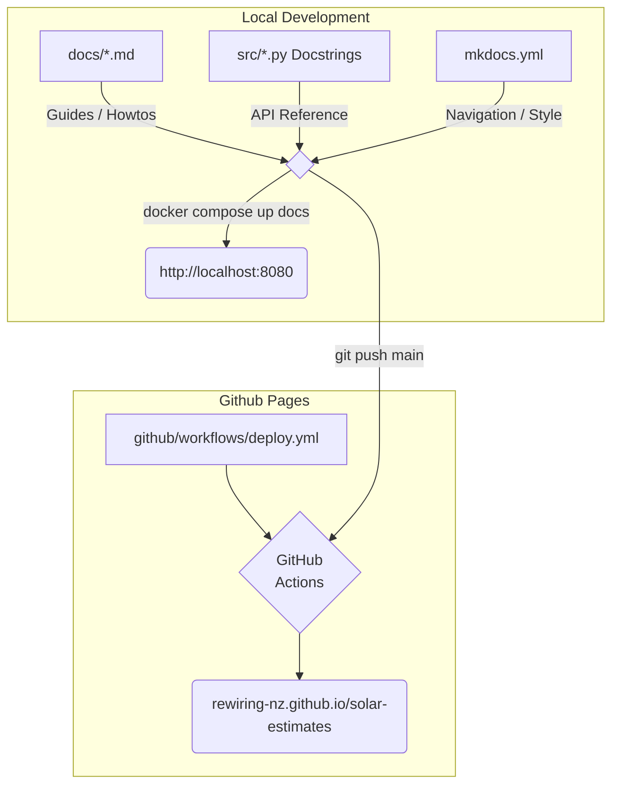

# Website Maintenance Guide

_This guide describes how the website infrastructure is setup._

**Last updated:** Jan 2026

**Target site:** https://rewiring-nz.github.io/solar-estimates/

## Publish pipeline


_Diagram: Doc toolchain workflow_

## Documentation Sources

1. **Standard Content**: Guides and overviews are stored as Markdown in the /docs/ directory.  
2. **Extracted Reference**: The "API Reference" section is automatically extracted from Python `docstrings` in /src/ using mkdocstrings.
3. **Navigation**: If you add a *new* file, you must register its path in the nav section of `/mkdocs.yml`.

### Local Preview

Before publishing, you can preview with:
```bash
# Change to project's root directory
#
# Start local web server
docker compose up docs

# View in a browser at: http://localhost:8000
```
### Publish Workflow

1. **The Trigger**: A `git push` to `main` triggers `/.github/workflows/deploy.yml`.  
2. **The Build**: Actions runs mkdocs gh-deploy, pushing HTML to the `gh-pages` branch.  
3. **The Hosting**: GitHub Pages watches gh-pages and refreshes the live site at https://rewiring-nz.github.io/solar-estimates/

## Technology Stack

* **MkDocs**: The static site generator that converts Markdown to HTML.  
* **Material for MkDocs**: The theme providing the UI/UX and search.  
* **mkdocstrings**: A plugin that inspects Python source code to generate the API reference.  
* **GitHub Actions**: The CI/CD engine that automates the build process.  
* **GitHub Pages**: The hosting service that serves the final files.
