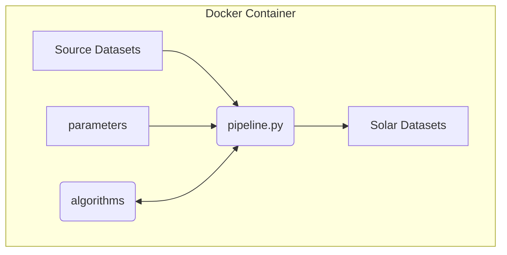

# Advanced User - Build your own layers

This section explains how tech-savvy advanced users can build solar-potential datasets using our project's scripts. 

## Prior knowledge

* You should know how to run applications from the command line, as our ```pipeline.py``` script runs from a terminal command line.  
* You should be familiar with [Docker](https://www.docker.com/), as we run our applications within the Docker framework.

## Key concepts


_Diagram: ```pipeline.py``` workflow which generates solar datasets._

### pipeline.py end-to-end script which continually improves

* Our main ```pipeline.py``` script provides end-to-end calculations to create solar potential datasets.  
* The ```pipeline.py``` script accepts parameters to select from datasets, algorithms, and constrained problem spaces.  
* With each release, we add attributes and improve results, by replacing estimations with better algorithms.

### CPU intensive

* We process large national datasets, using CPU intensive algorithms, which can take days to months to complete.  
* So we initially develop and test on small datasets, before scaling to the full problem space.

### Docker container

* Our command line scripts run inside a Docker container.  
* This enables our code to be run from multiple platforms, including Mac, Windows, Linux, and to scale to Cloud Computing.  
* We manage the complicated python and GRASS application dependencies within Docker, building upon [UbuntuGIS](https://wiki.ubuntu.com/UbuntuGIS).

## Quickstart: Install and build your first map layer

This quickstart describes how you can install and run our pipeline script to create your first map layers, based on our default dataset and parameters. 

### Prerequisites

* **Command Line:** Familiarity with running commands from a terminal.  
* **Docker:** Familiarity with [Docker](https://www.docker.com/). We use it to ensure the environment is consistent.  
* **Git (Optional):** Understanding `git` is helpful for managing updates. Refer to [GitHub's Git Guide](https://github.com/git-guides) for a quick overview.  
* **Admin Rights:** You will likely need administrator privileges to install Docker.

### Procedure

#### Task 1: Download the Solar-Estimates Code

You can either download the code as a simple zip file or use `git` to clone the repository.

##### Option 1A: Download and Unzip (Simplest)

```bash
# Move to your home directory
cd ~

# Download and unzip the latest source code 
wget https://github.com/rewiring-nz/solar-estimates/archive/refs/heads/main.zip 
unzip main.zip
cd ~/solar-estimates-main/
```

##### Option 1B: Clone with Git (Recommended for Developers)

```bash
# Move to your home directory
cd ~

# clone repository
`git clone https://github.com/rewiring-nz/solar-estimates.git
cd solar-estimates/
```

### **Task 2: Install Docker**

If you haven’t already installed Docker, follow the instructions for your operating system:

* **Windows or Mac:** Follow the official [Docker Desktop installation guide](https://docs.docker.com/get-started/get-docker/).  
* **Ubuntu or Debian Linux:** You can use our provided setup script:

```bash
# Navigate to the scripts directory and run the installer 
cd scripts/
sudo ./setup-docker.sh
```

### **Task 3: Run the Pipeline**

With Docker ready, you can now launch the processing pipeline. This process downloads required images and runs the analysis, which may take several minutes.

```bash
# Ensure you are in the project root directory  
docker compose up
```
You will see logs in your terminal as the `pipeline.sh` script executes.

Once finished, your generated map layers will be available in the `src/` directory.

### **Task 4: Stop and Clean Up**

When you are finished or want to stop the process, use the following command to shut down the Docker container:

```bash
# Stop the docker containers safely
docker compose down
```