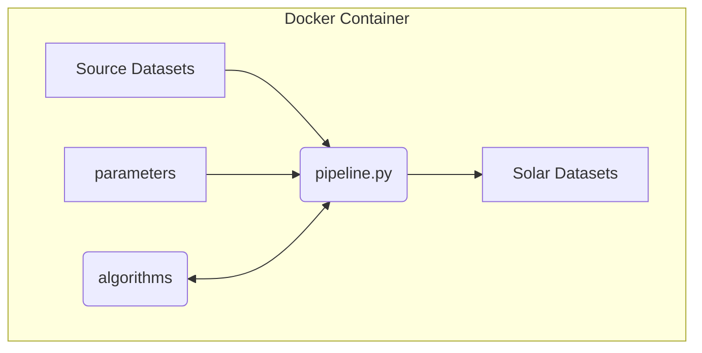

# Advanced User - Build your own layers

This section explains how tech-savvy advanced users can build solar-potential datasets using our project's scripts. 

## Prior knowledge

* You should know how to run applications from the command line, as our ```pipeline.py``` script runs from a terminal command line.  
* You should be familiar with [Docker](https://www.docker.com/), as we run our applications within the Docker framework.

## Key concepts


_Diagram: ```pipeline.py``` workflow which generates solar datasets._

### pipeline.py end-to-end script which continually improves

* Our main ```pipeline.py``` script provides end-to-end calculations to create solar potential datasets.  
* The ```pipeline.py``` script accepts parameters to select from datasets, algorithms, and constrained problem spaces.  
* With each release, we add attributes and improve results, by replacing estimations with better algorithms.

### CPU intensive

* We process large national datasets, using CPU intensive algorithms, which can take days to months to complete.  
* So we initially develop and test on small datasets, before scaling to the full problem space.

### Docker container

* Our command line scripts run inside a Docker container.  
* This enables our code to be run from multiple platforms, including Mac, Windows, Linux, and to scale to Cloud Computing.  
* We manage the complicated python and GRASS application dependencies within Docker, building upon [UbuntuGIS](https://wiki.ubuntu.com/UbuntuGIS).
