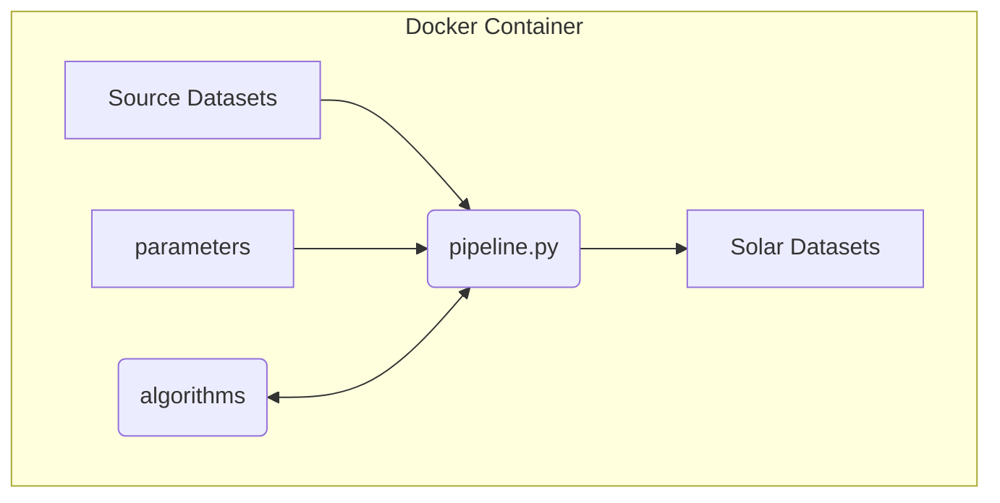

# Key concepts
_This page explains concepts and limitations to understand consider when building solar map layers._


_Diagram: ```pipeline``` workflow which generates solar datasets._

## Pipeline end-to-end script

* Our main ```pipeline``` script provides end-to-end calculations to create solar potential datasets.  
* The ```pipeline``` script is customizable.
* It accepts parameters to select from datasets, algorithms, and constrained problem spaces.  
* With each release, we add attributes and improve results, by replacing estimations with better algorithms.

## CPU intensive

* We process large national datasets, using CPU intensive algorithms, which can take days to months to complete.  
* So we initially develop and test on small datasets, before scaling to the full problem space.

## Docker container

* Our command line scripts run inside a Docker container.  
* This enables our code to be run from multiple platforms, including Mac, Windows, Linux, and to scale to Cloud Computing.  
* We manage the complicated python and GRASS application dependencies within Docker, building upon [UbuntuGIS](https://wiki.ubuntu.com/UbuntuGIS).


